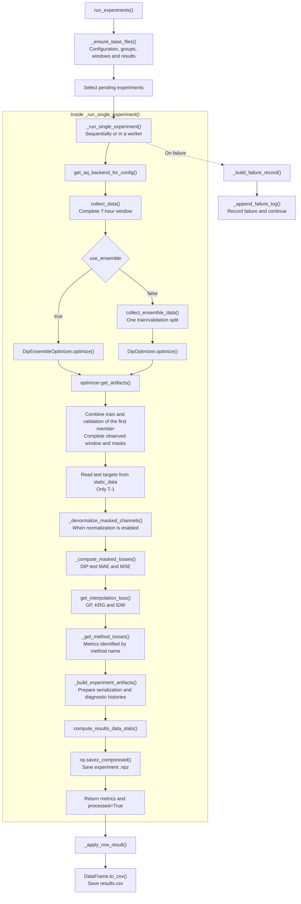
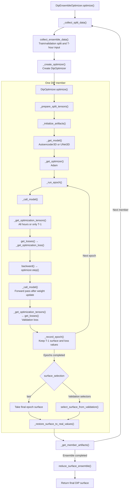
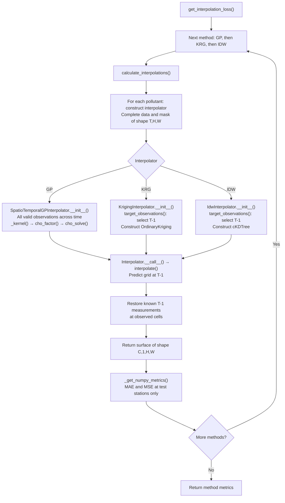

# Experiment Execution Flow

One experiment is one `(sensor_group, time_window)` pair. The input contains
`T` hourly observations ending at the evaluation timestamp. Every method is
evaluated at `T-1`, at the held-out stations. Arrows below show execution order;
the following diagrams expand the DIP and interpolation calls.

The source entry point is `src/metraq_dip/experiments.py::run_experiments()`.
See [Artifacts Schema](experiments.md) for the saved arrays and CSV columns.
Diagrams use Mermaid loaded from a CDN, so rendering requires internet access.

## Session and Single Experiment

`_ensure_base_files()` loads existing groups and timestamps from `data.npz`, or
generates them with `get_spread_test_groups()` and `_get_time_windows()` when
starting a session. Completed rows are skipped according to the current resume
logic. Adding GP columns to an old CSV does not itself run GP for completed rows;
historical results require a separate backfill.

## DIP Optimization

The ensemble repeats the member block `ensemble_size` times. With
`use_ensemble=false`, the experiment calls `DipOptimizer.optimize()` directly.

`optimization_timesteps=all` applies training and validation losses to the full
window; `last` restricts both losses to the final hour. In either case, stored
epoch predictions and the final evaluation concern `T-1`.

Source: `src/metraq_dip/trainer/dip_optimizer.py` and
`src/metraq_dip/trainer/dip_ensemble_optimizer.py`.

## GP, Kriging and IDW

All interpolators receive `(T, H, W)` values and masks for one pollutant. The
experiment combines training and validation observations from the first DIP
member, giving all available stations (20 in the Madrid 24-station setup).
Held-out test measurements are supplied separately to the metric calculation.

GP uses all observed hours; KRG and IDW extract the last hour internally with
`target_observations()`. Spatial coordinates are grid indices and GP time
coordinates are hourly indices. GP currently uses fixed kernel parameters.

Source: `src/metraq_dip/tools/tools.py` and
`src/metraq_dip/tools/interpolator.py`.

## Persistence and Diagnostics

`_build_experiment_artifacts()` runs after all final model metrics are computed.
It combines model-space surfaces with `reduce_surface_ensemble()`, collects
selected epoch indices and builds training/validation histories with
`_build_loss_history_cube()`. `_build_test_loss_history_cube()` evaluates stored
epoch surfaces against test measurements for retrospective diagnostics; these
test losses do not select epochs or update model weights.

Saved training and validation arrays retain only `T-1`, while the interpolators
receive the complete window directly from the optimizer's in-memory member
artifacts. Final test targets come directly from `static_data`. Prediction and
evaluation therefore do not depend on the compact serialization format.
